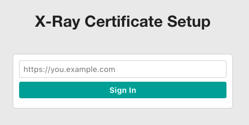
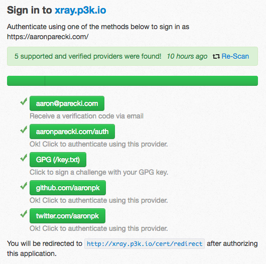
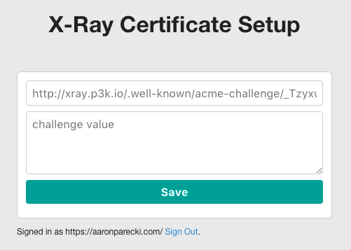
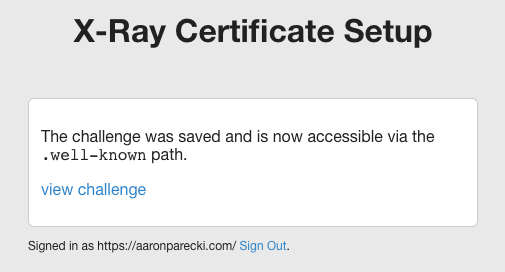
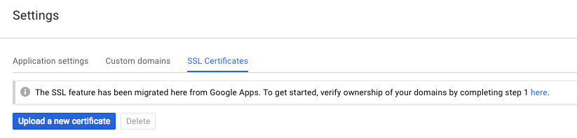
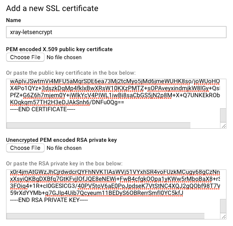
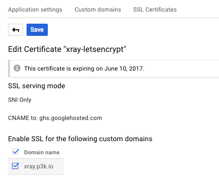

# Configuring HTTPS for XRay

If you run XRay on AppEngine, you'll need to generate an SSL certificate and upload it to AppEngine.

XRay has a built-in tool for assisting in generating a Let's Encrypt certificate.

## Set the Allowed Users

You'll first need to configure which users are allowed to use the SSL configuration utility. In `config.production.php`, add a list of URLs for who should be allowed to sign in. XRay will use indieauth.com to sign users in.

```
  public static $admins = [
    'https://aaronparecki.com/'
  ];
```

## Deploy to App Engine and Sign In

Deploy the project to App Engine, then visit http://xray.p3k.io/cert (using your own domain you installed it on) to begin setup.



Sign in using your domain name.



XRay will verify that the user who signed in matches the allowed users in the config file. If you get an error, double check that you've entered your domain in the config file properly, including the proper https scheme and a trailing slash for root domains. e.g. `https://aaronparecki.com/`

Once you're signed in, you will see a form where you can enter the Certbot challenge.



## Request a Certificate using Certbot

On your local computer, or some other server, install the Let's Encrypt Certbot utility.

Request a certificate using the manual mode. Run this command from the XRay project root so that your certificates will end up in the `certbot` folder in this project.

```
certbot -a manual certonly --config-dir certbot --work-dir certbot --logs-dir certbot -d xray.p3k.io
```

This will begin the request, and the client will pause and wait for you to enter the challenge on the website.

```
$ certbot -a manual certonly --config-dir certbot --work-dir certbot --logs-dir certbot -d xray.p3k.io
Saving debug log to /Users/aaronpk/Code/XRay/certbot/letsencrypt.log
Obtaining a new certificate
Performing the following challenges:
http-01 challenge for xray.p3k.io

-------------------------------------------------------------------------------
NOTE: The IP of this machine will be publicly logged as having requested this
certificate. If you're running certbot in manual mode on a machine that is not
your server, please ensure you're okay with that.

Are you OK with your IP being logged?
-------------------------------------------------------------------------------
(Y)es/(N)o: Y

-------------------------------------------------------------------------------
Make sure your web server displays the following content at
http://xray.p3k.io/.well-known/acme-challenge/{token} before continuing:

{challenge text here}
```

Copy the token and challenge from the console into the form on XRay, and click Save.




Now XRay has cached the token and challenge and will serve it from the `.well-known` URL for 10 minutes. You can verify this by clicking the "view challenge" link shown.

Back at the console, you can now press enter to continue.

```
-------------------------------------------------------------------------------
Press Enter to Continue
Waiting for verification...
Cleaning up challenges
Generating key (2048 bits): /Users/aaronpk/Code/XRay/certbot/keys/0001_key-certbot.pem
Creating CSR: /Users/aaronpk/Code/XRay/certbot/csr/0001_csr-certbot.pem
Non-standard path(s), might not work with crontab installed by your operating system package manager
```

Let's Encrypt will check the challenge URL and issue the certificate! The certificate will be saved to your computer at the path shown.

## Install the Certificate in App Engine

In App Engine, navigate to your project's settings, and click "SSL Certificates".



Click "Upload a new certificate".

Let's Encrypt does not create an RSA private key, so you'll have to convert the private key it made into an RSA key.

```
$ openssl rsa -in certbot/live/xray.p3k.io/privkey.pem > certbot/live/xray.p3k.io/privkey-rsa.pem
```

Copy and paste the `privkey-rsa.pem` and `fullchain.pem` files into App Engine.



Edit the certificate and enable it on the domain name.



## All Done!

You're all done! Now just don't forget what you did, because you'll need to do this all again in 3 months when the certificate expires!

Unfortunately App Engine does not yet have an API for programmatically uploading certificates. However there is [an outstanding bug](https://issuetracker.google.com/issues/35900034) to request this feature, so it will likely be supported soon. Once there is an API, then the whole certificate request process can be completely automated in code.

It will take a few minutes for App Engine to start serving the new certificate, so wait a little while if you get an SSL error.

